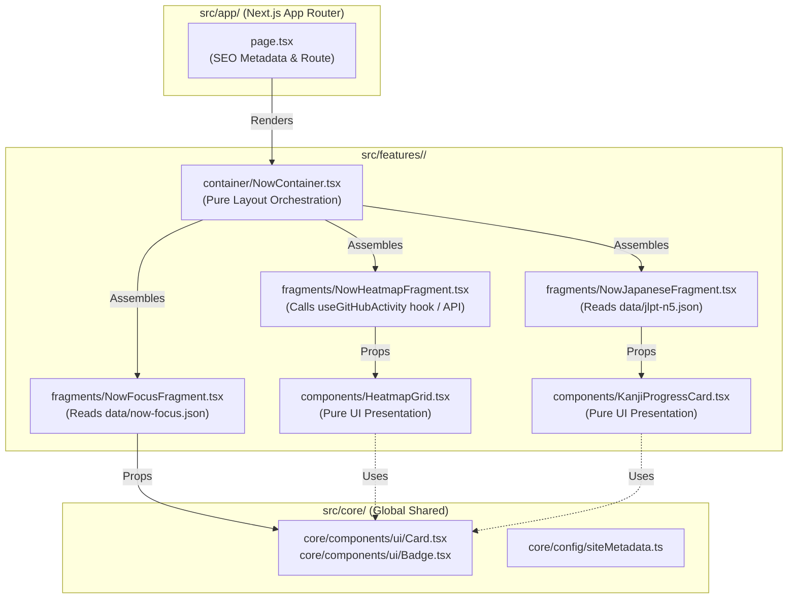

# Next.js Codebase Architecture — "bas." Personal Portfolio

**Document Version:** 1.0  
**Target Stack:** Next.js 14+ (App Router), TypeScript Strict, Tailwind CSS 4, Framer Motion, pnpm  
**Architectural Pattern:** Modular Feature-Scoped Architecture (`core` / `features` / `app`)

---

## 1. Executive Summary & Architectural Principles

Arsitektur codebase `"bas."` didesain dengan prinsip **Modular Separation of Concerns** dan **Zero Prop-Drilling pada Container Layer**. 

### Key Design Principles:
1. **Thin App Router Layer (`src/app/`)**: File `page.tsx` di App Router **hanya** bertugas mengatur rute, metadata SEO (JSON-LD, OpenGraph, Title, Description), serta memanggil `Container` dari feature terkait.
2. **Feature Encapsulation (`src/features/`)**: Setiap halaman/fitur diisolasi dalam modul mandiri. Komponen, hook, i18n, dan data statis yang hanya relevan untuk fitur tersebut tidak boleh "bocor" ke root global.
3. **Strict 3-Tier Feature Layering (`container` → `fragments` → `components`)**:
   - **`container/`**: *Layout orchestrator* satu halaman penuh. Menyusun posisi *section/fragments* tanpa *prop drilling* atau logika bisnis.
   - **`fragments/`**: *Smart sections* tempat alur pemanggilan API/data (Server Component data fetching, MDX loader, atau React Query hooks) terjadi. Fragment mendistribusikan data ke komponen visual via props.
   - **`components/`**: *Pure presentational UI* yang hanya digunakan oleh fitur tersebut.
4. **Global Shared Layer (`src/core/`)**: Tempat penyimpanan seluruh atom/molekul UI global (Tombol, Card, Navbar, Footer), utilitas umum, konfigurasi tema, design tokens, dan tipe data publik.

---

## 2. High-Level Directory Structure (`src/`)

```
src/
├── app/                        # [NEXT.JS APP ROUTER] Thin routing & SEO metadata layer
│   ├── layout.tsx              # Root layout -> renders <Navbar /> & <Footer /> from @core/components/layout
│   ├── page.tsx                # Homepage (/) -> renders <HomepageContainer />
│   ├── writing/
│   │   ├── page.tsx            # Blog list (/writing) -> renders <BlogsContainer />
│   │   └── [slug]/
│   │       └── page.tsx        # Blog detail (/writing/[slug]) -> renders <BlogDetailContainer />
│   ├── api/                    # API routes
│   │   └── contact/
│   │       └── route.ts        # Contact form Edge handler
│   ├── robots.ts               # Automated robots.txt
│   └── sitemap.ts              # Dynamic XML sitemap
│
├── core/                       # [GLOBAL SHARED LAYER] Shared across all features
│   ├── components/
│   │   ├── ui/                 # Reusable UI primitives (each in its own folder)
│   │   │   ├── Button/         # Button.tsx, Button.test.tsx, Button.stories.tsx
│   │   │   ├── Card/           # Card.tsx, Card.test.tsx, Card.stories.tsx
│   │   │   ├── Badge/          # Badge.tsx, Badge.test.tsx, Badge.stories.tsx
│   │   │   ├── Input/          # Input.tsx, Input.test.tsx, Input.stories.tsx
│   │   │   ├── Textarea/       # Textarea.tsx, Textarea.test.tsx, Textarea.stories.tsx
│   │   │   └── ThemeToggle/    # ThemeToggle.tsx, ThemeToggle.test.tsx, ThemeToggle.stories.tsx
│   │   └── layout/             # Global layout components (each in its own folder)
│   │       ├── Navbar/         # Navbar.tsx, Navbar.test.tsx, Navbar.stories.tsx
│   │       ├── Footer/         # Footer.tsx, Footer.test.tsx, Footer.stories.tsx
│   │       └── SectionWrapper/ # SectionWrapper.tsx, SectionWrapper.test.tsx, SectionWrapper.stories.tsx
│   ├── config/                 # siteMetadata.ts, navigation.ts
│   ├── hooks/                  # Global hooks (useTheme, useMediaQuery, useScrollDirection)
│   ├── lib/                    # Utility functions (cn.ts, formatDate.ts, mdx-loader.ts)
│   ├── styles/                 # index.css (Tailwind CSS 4 + Design Tokens)
│   └── types/                  # Global TypeScript interfaces
│
└── features/                   # [FEATURE-SCOPED LAYER] Exactly 3 features (1 per page in prototype)
    ├── homepage/               # Feature 1: Homepage (/, includes Hero, About, Experience, Now, Contact)
    │   ├── container/
    │   │   └── HomepageContainer.tsx
    │   ├── fragments/          # Each fragment in its own folder (.tsx, .test.tsx, .stories.tsx)
    │   │   ├── HeroSection/    # HeroSection.tsx, HeroSection.test.tsx, HeroSection.stories.tsx
    │   │   ├── AboutSection/   # AboutSection.tsx, AboutSection.test.tsx, AboutSection.stories.tsx
    │   │   ├── ExperienceSection/
    │   │   ├── NowSection/     # Self-Exploration / What I'm working on
    │   │   └── ContactSection/
    │   ├── components/         # Homepage-only UI components (each in its own folder)
    │   │   ├── ProfileAvatar/  # ProfileAvatar.tsx, ProfileAvatar.test.tsx, ProfileAvatar.stories.tsx
    │   │   ├── ExperienceCard/
    │   │   ├── FocusCard/
    │   │   ├── HeatmapGrid/
    │   │   └── ContactForm/
    │   ├── hooks/
    │   ├── i18n/
    │   └── data/
    ├── blogs/                  # Feature 2: Blog Listing (/writing)
    │   ├── container/
    │   │   └── BlogsContainer.tsx
    │   ├── fragments/
    │   │   └── BlogListSection/ # BlogListSection.tsx, .test.tsx, .stories.tsx
    │   ├── components/
    │   │   ├── BlogCard/       # BlogCard.tsx, .test.tsx, .stories.tsx
    │   │   └── BlogTagFilter/
    │   ├── hooks/
    │   ├── i18n/
    │   └── data/
    └── blog/                   # Feature 3: Blog Detail (/writing/[slug])
        ├── container/
        │   └── BlogDetailContainer.tsx
        ├── fragments/
        │   ├── BlogPostHeader/ # BlogPostHeader.tsx, .test.tsx, .stories.tsx
        │   └── BlogPostContent/
        ├── components/         # Feature-scoped MDX custom components (ONLY used in blog post detail)
        │   ├── CodeBlock/      # CodeBlock.tsx, CodeBlock.test.tsx, CodeBlock.stories.tsx
        │   ├── Callout/        # Callout.tsx, Callout.test.tsx, Callout.stories.tsx
        │   ├── VocabCard/      # VocabCard.tsx, VocabCard.test.tsx, VocabCard.stories.tsx
        │   └── TableOfContents/
        ├── hooks/
        ├── i18n/
        └── data/
```

---

## 3. Layer Breakdown & Responsibilities

### 3.1 `src/app/` — Thin Routing & SEO Layer
* **Tanggung Jawab:**
  * Routing dan pemetaan URL App Router.
  * Menghasilkan **SEO Metadata** statis maupun dinamis (Title, Description, OpenGraph, Twitter Card, JSON-LD Structured Data).
  * Menangani *Server-Side Caching*, *Revalidation* (ISR), dan HTTP status rules.
* **Larangan:**
  * Tidak boleh menulis UI markup HTML kompleks atau logika bisnis di file ini.
  * HANYA boleh mengimpor dan me-render `<Container />` dari `src/features/*`.

#### Contoh `src/app/now/page.tsx`:
```tsx
import { Metadata } from 'next';
import { NowContainer } from '@features/now/container/NowContainer';
import { siteMetadata } from '@core/config/siteMetadata';

export const metadata: Metadata = {
  title: `Now — ${siteMetadata.title}`,
  description: 'What Ilyas Bashirah is currently focused on, exploring, and building.',
  openGraph: {
    title: `Now — ${siteMetadata.title}`,
    description: 'What Ilyas Bashirah is currently focused on, exploring, and building.',
    url: `${siteMetadata.siteUrl}/now`,
  },
};

export default function NowPage() {
  return (
    <main>
      <NowContainer />
    </main>
  );
}
```

---

### 3.2 `src/features/<feature_name>/` — Encapsulated Feature Domain

Setiap folder fitur memiliki **6 subdirektori standar** dan mematuhi aturan **Folder-per-Component & Folder-per-Fragment**:

```
src/features/blogs/
├── container/
│   └── BlogsContainer.tsx
├── fragments/
│   └── BlogListSection/             # Folder per fragment
│       ├── BlogListSection.tsx
│       ├── BlogListSection.test.tsx
│       └── BlogListSection.stories.tsx
├── components/
│   ├── BlogCard/                    # Folder per component
│   │   ├── BlogCard.tsx
│   │   ├── BlogCard.test.tsx
│   │   └── BlogCard.stories.tsx
│   └── BlogTagFilter/
│       ├── BlogTagFilter.tsx
│       ├── BlogTagFilter.test.tsx
│       └── BlogTagFilter.stories.tsx
├── hooks/
├── i18n/
└── data/
```

> **⚡ Mengapa hanya ada 3 fitur (`homepage`, `blogs`, `blog`)?**
> Berdasarkan prototype Figma AI (`Personal Portfolio/src/`), aplikasi ini terdiri dari **3 rute/halaman utama**:
> 1. `/` (Homepage — berisi Hero, About, Experience, Now/Self-Exploration, dan Contact di satu halaman).
> 2. `/writing` (Blog Listing).
> 3. `/writing/[slug]` (Blog Detail).
> Oleh karena itu, fitur dikelompokkan 1-ke-1 sesuai rute halaman tersebut.

> **📦 Mengapa komponen kustom MDX diletakkan di `src/features/blog/components/`?**
> Komponen MDX (seperti `CodeBlock`, `Callout`, dan `VocabCard`) **hanya digunakan pada halaman detail artikel blog (`/writing/[slug]`)**. Oleh karena itu, komponen tersebut dilokalisir di fitur **`blog`**, tidak ditaruh di dalam `src/core/components/`.

| Layer | Fungsi Utama | Aturan & Constraint |
|---|---|---|
| **`container/`** | **Page Layout Orchestrator**<br>Menyusun urutan *section/fragments* menjadi satu halaman utuh. | <ul><li>**Zero Prop-Drilling:** Tidak boleh menerima data kompleks lalu mengoper berderet ke anak-anaknya.</li><li>Hanya mengatur struktur, *spacing*, dan urutan *section*.</li><li>Dapat berupa Server Component.</li></ul> |
| **`fragments/`** | **Smart Data & State Blocks**<br>Bagian/blok fungsional yang mengambil data (API, MDX, React Query, static JSON). | <ul><li>Mengambil data mandiri (*self-fetching*), baik Server-Side `async` maupun Client-Side via hooks/React Query.</li><li>Meneruskan hasil data langsung ke komponen lokal (`components/`) atau global (`@core/components/`).</li></ul> |
| **`components/`** | **Feature-Scoped Pure UI Components**<br>Komponen presentasional yang eksklusif untuk halaman ini. | <ul><li>Tidak melakukan *async data fetching*.</li><li>Hanya menerima props dan me-render UI visual.</li><li>Wajib dilengkapi dengan file `.stories.tsx` dan `.test.tsx`.</li></ul> |
| **`hooks/`** | **Feature-Scoped Custom Hooks**<br>Logika interaksi, kalkulasi, atau data fetching spesifik fitur ini. | <ul><li>Contoh: `useGitHubHeatmap.ts`, `useKanjiFlipCard.ts`.</li></ul> |
| **`i18n/`** | **Feature-Scoped Copy & Translations**<br>Kamus string/label untuk fitur tersebut (English / 日本語). | <ul><li>Menghindari *hardcoded string text* di JSX agar mudah dikelola dan dilokalisasi.</li></ul> |
| **`data/`** | **Static Data & Configs**<br>File JSON statis, referensi MDX, atau konstanta lokal fitur. | <ul><li>Contoh: `jlpt-n5-milestones.json`, `now-focus.json`.</li></ul> |

---

### 3.3 `src/core/` — Global Shared Layer (Tailwind + Design Tokens)
Semua yang ada di dalam `src/core/` adalah **shared public API** dalam proyek:
* **`src/core/components/ui/`**: Primitif desain token atom (Button, Card, Badge, Input, ThemeToggle).
* **`src/core/components/layout/`**: **Global Navbar & Footer** (`Navbar.tsx`, `Footer.tsx`, `SectionWrapper.tsx`). Komponen navigasi utama dan footer **wajib diletakkan di `src/core/components/layout/`** — `src/app/layout.tsx` hanya bertugas mengimpor dan me-render komponen tersebut.
* **`src/core/hooks/`**: **Global React Hooks** (`useTheme.ts`, `useMediaQuery.ts`, `useScrollDirection.ts`, `useLocalStorage.ts`). Hooks lintas fitur (seperti pengatur tema gelap/terang `useTheme`) **wajib ditaruh di `core/hooks`**, bukan di dalam `features/`.
* **`src/core/lib/`**: Utiliti murni (`cn.ts` untuk Tailwind class merge, `formatDate.ts`, `mdx-loader.ts`).
* **`src/core/config/`**: Data konfigurasi global (`siteMetadata.ts`, `navigation.ts`).
* **`src/core/styles/`**: File CSS utama (`index.css`) berisikan **Tailwind CSS 4 + Design Tokens** (pemetaan CSS Custom Properties dari `docs/DESIGN_TOKENS.md` dan `docs/BIBIT_COLOR_TOKENS.md` untuk tema Light & Dark).

---

## 4. Data Flow & Communication Diagram



---

## 5. End-to-End Implementation Example (Feature: `blogs` / Writing List)

### 5.1 `src/features/blogs/container/BlogsContainer.tsx`
```tsx
import React from 'react';
import { BlogListSection } from '../fragments/BlogListSection/BlogListSection';

export function BlogsContainer() {
  return (
    <div className="mx-auto max-w-5xl px-4 py-16 sm:px-6 lg:px-8">
      {/* Container hanya menyusun Fragment — Zero Prop Drilling */}
      <BlogListSection />
    </div>
  );
}
```

### 5.2 `src/features/blogs/fragments/BlogListSection/BlogListSection.tsx`
```tsx
import React from 'react';
import { BlogCard } from '../../components/BlogCard/BlogCard';
import { BlogTagFilter } from '../../components/BlogTagFilter/BlogTagFilter';
import { fetchAllArticles } from '../../hooks/useArticles';

export async function BlogListSection() {
  // Fragment melakukan data-fetching mandiri
  const articles = await fetchAllArticles();

  return (
    <section aria-labelledby="writing-title" className="space-y-8">
      <div className="space-y-2">
        <h1 id="writing-title" className="text-3xl font-bold tracking-tight text-neutral-900 dark:text-white">
          Writing
        </h1>
        <p className="text-base text-neutral-600 dark:text-neutral-400">
          Thoughts on React, frontend architecture, and continuous learning.
        </p>
      </div>
      
      <BlogTagFilter />

      <div className="grid gap-6 sm:grid-cols-2">
        {articles.map((article) => (
          <BlogCard key={article.slug} article={article} />
        ))}
      </div>
    </section>
  );
}
```

### 5.3 `src/features/blogs/components/BlogCard/BlogCard.tsx`
```tsx
import React from 'react';
import Link from 'next/link';
import { Badge } from '@core/components/ui/Badge/Badge';
import type { ArticleMetadata } from '../../types/blogs.types';

interface BlogCardProps {
  article: ArticleMetadata;
}

export function BlogCard({ article }: BlogCardProps) {
  return (
    <Link
      href={`/writing/${article.slug}`}
      className="group block rounded-xl border border-neutral-200 bg-white p-6 shadow-sm transition-all hover:-translate-y-1 hover:border-[#CCEEE1] dark:border-neutral-800 dark:bg-neutral-900/50 dark:hover:border-[#00BF71]/40"
    >
      <div className="space-y-4">
        <div className="flex items-center justify-between">
          <Badge label={article.tags[0]} />
          <span className="text-xs text-neutral-500">{article.readTimeMinutes} min read</span>
        </div>
        <h2 className="text-xl font-semibold text-neutral-900 transition-colors group-hover:text-[#00AB6B] dark:text-white dark:group-hover:text-[#00BF71]">
          {article.title}
        </h2>
        <p className="line-clamp-2 text-sm text-neutral-600 dark:text-neutral-400">
          {article.summary}
        </p>
      </div>
    </Link>
  );
}
```

---

## 6. Dev Tooling & Quality Gates Specification

Codebase ini mewajibkan **standard kualitas tinggi** sebelum kode masuk ke repository, dikelola secara otomatis menggunakan *tooling stack* modern:

```
+-----------------------------------------------------------------------------+
|                            QUALITY GATE MATRIX                              |
+-------------------+---------------------------------------------------------+
| Tool              | Function & Target                                       |
+-------------------+---------------------------------------------------------+
| TypeScript Strict | `noImplicitAny: true`, strict null checks, zero any     |
| ESLint + Prettier | Automatic linting & formatting on save and pre-commit   |
| Vitest + RTL      | Unit & Integration tests (`*.test.tsx`, `*.test.ts`)     |
| Playwright        | End-to-End browser journey tests (`e2e/*.spec.ts`)      |
| Storybook 8       | Component docs & visual testing (`*.stories.tsx`)       |
| Husky             | Pre-commit (lint-staged + test) & Pre-push (build check)|
| Commitlint        | Enforces Conventional Commits (`feat:`, `fix:`, `docs:`)|
+-------------------+---------------------------------------------------------+
```

### 6.1 Testing Naming Conventions
* **Unit Tests (Vitest + React Testing Library):**
  * File test disandingkan langsung di folder yang sama dengan komponen/utilitas.
  * Pola: `ComponentName.test.tsx` atau `utilName.test.ts`.
  * Wajib meninjau *accessibility tree* dan *keyboard navigation*.
* **Storybook Component Stories:**
  * Wajib ada untuk SEMUA komponen di `src/core/components/` dan `src/features/**/components/`.
  * Pola: `ComponentName.stories.tsx`.
  * Menggunakan *controls* untuk meliput Light Mode dan Dark Mode.
* **E2E Tests (Playwright):**
  * Disimpan di folder terpusat `/e2e/` di root proyek.
  * Menembak seluruh alur navigasi halaman utama (`/`, `/now`, `/writing`, `/uses`, `/contact`).

### 6.2 Husky Pre-Commit Workflow
1. Saat menjalankan `git commit`:
   - **Commitlint** memastikan pesan commit mematuhi konvensi konvensional.
   - **lint-staged** memicu ESLint dan Prettier HANYA pada file yang di-*stage*.
   - **Vitest --run** menjalankan unit test terkait untuk memastikan tidak ada pemecahan regresi.

---

## 7. Reference Prototype (`Personal Portfolio/`) & Migration Strategy

Proyek ini memiliki *prototype* visual yang dibuat menggunakan Figma AI di dalam direktori:
```
Personal Portfolio/
├── src/
│   ├── App.home.tsx          # Monolithic homepage prototype (44KB)
│   ├── pages/
│   │   ├── ArticleDetail.tsx # Blog detail prototype
│   │   └── WritingList.tsx   # Blog listing prototype
│   └── data/
│       └── articles.ts       # Mock blog articles
```

### 7.1 Mengapa Melakukan Rewrite ke Next.js Modular Architecture?
Walaupun purwarupa di folder `Personal Portfolio/` sudah memiliki tampilan visual yang baik, proyek tersebut adalah SPA monolithic (Vite/React) yang tidak cocok untuk standar produksi berskala besar karena:
1. **File Monolithic 44KB (`App.home.tsx`)**: Menggabungkan seluruh hero, about, experience, now, dan contact dalam satu file tanpa *separation of concerns*.
2. **Keterbatasan SEO & Rendering**: Tidak mendukung App Router Server Components, SSG untuk Blog MDX, atau dynamic OpenGraph metadata yang krusial untuk portfolio profesional.
3. **Optimasi Deploy Vercel**: Next.js App Router memungkinkan optimasi *Edge API Routes* (misal form kontak) dan *Incremental Static Regeneration* untuk halaman `/now`.

### 7.2 Panduan Migrasi / Ekstraksi dari Prototype ke Next.js
Saat membangun codebase Next.js, kita mengacu pada folder `Personal Portfolio/src/` sebagai **sumber acuan UI (Visual Reference & Copywriting Source)** dengan aturan pemecahan berikut:
* **Komponen Layout Global (`Navbar`, `Footer`)**: Diekstrak dari `App.home.tsx` dan dipindahkan menjadi **`src/core/components/layout/Navbar.tsx`** dan **`Footer.tsx`**.
* **Bagian Homepage (`Hero`, `About`, `Experience`)**: Dipecah menjadi *fragments* terisolasi di **`src/features/home/fragments/`**, disusun oleh **`src/features/home/container/HomeContainer.tsx`**.
* **Bagian Blog (`WritingList`, `ArticleDetail`)**: Diekstrak dari `Personal Portfolio/src/pages/` dan direkonstruksi menjadi **`src/features/writing/`** berbasis MDX + Server Components.
* **Tema Warna**: Ditingkatkan menggunakan token resmi dari **`docs/BIBIT_COLOR_TOKENS.md`** dan **`docs/DESIGN_TOKENS.md`**.

---

## 8. Path Aliases (`tsconfig.json`)

Agar impor kode bersih dan tidak mengandung relative path bertingkat (`../../../../`), dikonfigurasi alias berikut:

```json
{
  "compilerOptions": {
    "baseUrl": ".",
    "paths": {
      "@app/*": ["src/app/*"],
      "@core/*": ["src/core/*"],
      "@features/*": ["src/features/*"],
      "@docs/*": ["docs/*"],
      "@test/*": ["test/*"]
    }
  }
}
```

### Aturan Import antar-Layer:
* **`@app`** diperbolehkan mengimpor **`@features`** dan **`@core`**.
* **`@features`** DI-LARANG MENGIMPOR **`@app`**.
* **`@features/<name>`** DI-LARANG MENGIMPOR **`@features/<another_name>`** secara langsung (jika ada yang perlu dipakai bersama, pindahkan ke **`@core`**).
* **`@core`** DI-LARANG MENGIMPOR **`@features`** atau **`@app`**.

---

## 9. Verification & Readiness Checklist (Phase 1 Ready)

Dokumen ini menjadi acuan utama saat memulai eksekusi **Phase 1 (Next.js & Dev Tooling Setup)**:

- [ ] Folder struktur persis mematuhi pola `src/core`, `src/features`, `src/app`.
- [ ] Komponen **Navbar** dan **Footer** berada di **`src/core/components/layout/`**, BUKAN di dalam `src/app/`.
- [ ] Global hooks (seperti pengatur tema `useTheme`) berada di **`src/core/hooks/`**, BUKAN di `src/features/`.
- [ ] Tailwind CSS terhubung dengan Design Tokens di `src/core/styles/index.css`.
- [ ] Layer `container/` pada fitur diverifikasi **tidak melakukan prop-drilling**.
- [ ] Semua pemanggilan data async berada pada layer `fragments/`.
- [ ] File komponen di `components/` memiliki pasangan `.stories.tsx` dan `.test.tsx`.
- [ ] Konfigurasi warna resmi memakai **GreatFrontEnd Emerald / Bibit Green (`#00AB6B` / `#00BF71`)**.
- [ ] Pre-commit hook Husky aktif menahan commit jika ada error linting atau test gagal.
