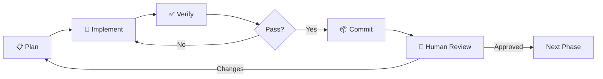
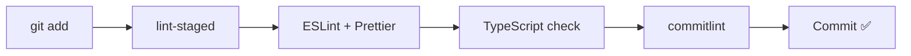

# Execution Plan & Estimation
## "bas." Personal Portfolio Website

**Document Version:** 2.0  
**Created:** 2026-07-31  
**Last Updated:** 2026-07-31  
**Methodology:** Agentic Development Life Cycle (ADLC)

---

## 1. Development Philosophy: ADLC

### What is Agentic Development Life Cycle?

ADLC adalah pendekatan development di mana AI agent dan developer bekerja bersama secara iteratif. Setiap fase memiliki:

- **Agent Skills** — kumpulan instruksi yang bisa digunakan kembali oleh AI agent
- **Checkpoints** — titik verifikasi sebelum lanjut ke fase berikutnya
- **Human-in-the-loop** — developer (Anda) review dan approve setiap fase

### Workflow per Phase



### Quality Gates (per commit)



---

## 2. Phase Breakdown

### Phase 0: Foundation Documents ✅ (Done)

| Task | Estimated | Status |
|---|---|---|
| PRD document | 30 min | ✅ Done |
| Design Tokens specification | 30 min | ✅ Done |
| Figma AI prompts | 20 min | ✅ Done |
| Agent Skills setup | 20 min | ✅ Done |
| Execution Plan (this doc) | 15 min | ✅ Done |
| Review & iteration (Now page, tooling) | 30 min | ✅ Done |

**Phase 0 Total: ~2.5 hours**

---

### Phase 1: Next.js Project Setup, Design System & Dev Tooling

**Goal:** Boilerplate Next.js app dengan design system, dev tooling, dan Storybook terimplementasi.

| # | Task | Agent Skill | Estimated | Depends On | Status |
|---|---|---|---|---|---|
| 1.1 | [x] Initialize Next.js 14+ (App Router, TypeScript, Tailwind, pnpm) | `nextjs-setup` | 15 min | - | ✅ Done |
| 1.2 | [x] Configure Tailwind with design tokens | `design-system` | 30 min | 1.1 | ✅ Done |
| 1.3 | [x] Setup CSS custom properties (tokens) in globals.css | `design-system` | 20 min | 1.1 | ✅ Done |
| 1.4 | [x] Install & configure fonts (Inter, JetBrains Mono via next/font) | `design-system` | 10 min | 1.1 | ✅ Done |
| 1.5 | [x] Setup dark/light mode toggle (data-theme attribute) | `design-system` | 30 min | 1.2, 1.3 | ✅ Done |
| 1.6 | [x] Setup ESLint + Prettier + eslint-plugin-jsx-a11y | `nextjs-setup` | 15 min | 1.1 | ✅ Done |
| 1.7 | [x] **Setup Husky + lint-staged** | `dev-tooling` | 15 min | 1.6 | ✅ Done |
| 1.8 | [x] **Setup Commitlint (@commitlint/config-conventional)** | `dev-tooling` | 10 min | 1.7 | ✅ Done |
| 1.9 | [x] Setup folder structure (components, lib, content, types) | `nextjs-setup` | 10 min | 1.1 | ✅ Done |
| 1.10 | [x] Create base layout (RootLayout, metadata, providers) | `nextjs-setup` | 20 min | 1.2-1.5 | ✅ Done |
| 1.11 | [x] Setup Framer Motion provider | `animation-system` | 10 min | 1.1 | ✅ Done |
| 1.12 | [x] **Setup Storybook 8** (init, configure, first story) | `storybook` | 30 min | 1.1, 1.2 | ✅ Done |
| 1.13 | [x] **Setup Vitest + React Testing Library** | `testing` | 20 min | 1.1 | ✅ Done |
| 1.14 | [x] **Setup MCP configuration** (.mcp.json) | `mcp-setup` | 15 min | 1.1 | ✅ Done |
| 1.15 | [x] Create cn() utility + base UI primitives (Button) | `component-build` | 15 min | 1.2 | ✅ Done |
| 1.16 | [x] Verify: build, lint, test, storybook, theme toggle | - | 20 min | All above | ✅ Done |

**Phase 1 Total: ~5 hours (✅ Completed)**  
**Checkpoint:** App builds, theme toggle works, Husky hooks active, Storybook runs, first test passes.

---

### Phase 2: Layout Components & Navigation

**Goal:** Global layout (sidebar + content split), navigasi, dan Storybook stories.

| # | Task | Agent Skill | Estimated | Depends On | Status |
|---|---|---|---|---|---|
| 2.1 | [x] Create Glass Navbar component (desktop capsule) | `component-build` | 45 min | Phase 1 | ✅ Done |
| 2.2 | [x] Create Mobile Navigation (drawer + overlay in GlassNavbar) | `component-build` | 45 min | 2.1 | ✅ Done |
| 2.3 | [x] Integrate global header & footer in Root Layout (`src/app/layout.tsx`) | `component-build` | 30 min | Phase 1 | ✅ Done |
| 2.4 | [x] Create Theme Toggle component (Sun/Moon icon in `src/core/components/ui/`) | `component-build` | 20 min | Phase 1 | ✅ Done |
| 2.5 | [x] Create Footer component (`src/core/components/layout/Footer`) | `component-build` | 15 min | Phase 1 | ✅ Done |
| 2.6 | [x] Create Skip-to-content link (a11y in GlassNavbar) | `accessibility` | 10 min | Phase 1 | ✅ Done |
| 2.7 | [x] Create UI primitive: Badge (`src/core/components/ui/Badge`) | `component-build` | 20 min | Phase 1 | ✅ Done |
| 2.8 | [x] Create UI primitive: Card (`src/core/components/ui/Card`) | `component-build` | 20 min | Phase 1 | ✅ Done |
| 2.9 | [x] Create UI primitive: Pill (`src/core/components/ui/Pill`) | `component-build` | 20 min | Phase 1 | ✅ Done |
| 2.10 | [x] Create UI primitive: NowBadge (`src/core/components/ui/NowBadge`) | `component-build` | 20 min | Phase 1 | ✅ Done |
| 2.11 | [x] **Write Storybook stories for all layout & UI primitive components** | `storybook` | 30 min | 2.1-2.10 | ✅ Done |
| 2.12 | [x] **Write Vitest unit tests for all layout & UI primitive components** | `testing` | 20 min | 2.1-2.10 | ✅ Done |
| 2.13 | [x] Verify: responsive layout, nav works, a11y keyboard nav, Storybook, 100% test pass | - | 20 min | All above | ✅ Done |

**Phase 2 Total: ~5.5 hours (✅ Completed)**  
**Checkpoint:** Full responsive layout, navigation, theme toggle, all components in Storybook.

---

### Phase 3: Home Page Sections

**Goal:** Semua section di halaman utama.

| # | Task | Agent Skill | Estimated | Depends On | Status |
|---|---|---|---|---|---|
| 3.1 | [x] Hero section (name, tagline, CTA, status badge, photo) | `component-build` | 60 min | Phase 2 | ✅ Done |
| 3.2 | [x] About section (bio text, tech stack pills) | `component-build` | 30 min | Phase 2 | ✅ Done |
| 3.3 | [x] Experience section (timeline, company cards) | `component-build` | 60 min | Phase 2 | ✅ Done |
| 3.4 | [x] Featured Writing section (3 post cards, skeleton) | `component-build` | 30 min | Phase 2 | ✅ Done |
| 3.5 | [x] Now preview section (current focus + heatmap mini) | `component-build` | 45 min | Phase 2 | ✅ Done |
| 3.6 | [x] Contact section (form + validation) | `component-build` | 45 min | Phase 2 | ✅ Done |
| 3.7 | [x] Contact form API route (server action / client simulation) | `nextjs-setup` | 30 min | 3.6 | ✅ Done |
| 3.8 | [x] Add scroll animations (Framer Motion) to all sections | `animation-system` | 45 min | 3.1-3.6 | ✅ Done |
| 3.9 | [x] **Write Storybook stories for section components** | `storybook` | 20 min | 3.1-3.6 | ✅ Done |
| 3.10 | [x] Verify: all sections render, responsive, animations smooth | - | 30 min | All above | ✅ Done |

**Phase 3 Total: ~6.5 hours (✅ Completed)**  
**Checkpoint:** Home page complete with all sections, animations, responsive.

---

### Phase 4: Blog System

**Goal:** Full blog dengan MDX, listing, individual posts.

| # | Task | Agent Skill | Estimated | Depends On | Status |
|---|---|---|---|---|---|
| 4.1 | [x] Setup MDX pipeline (next-mdx-remote or contentlayer) | `blog-system` | 45 min | Phase 1 | ✅ Done |
| 4.2 | [x] Create blog content folder structure + sample posts | `blog-system` | 30 min | 4.1 | ✅ Done |
| 4.3 | [x] Blog listing page (/blog) with tag filtering | `blog-system` | 60 min | 4.1 | ✅ Done |
| 4.4 | [x] Individual blog post page (/blog/[slug]) | `blog-system` | 60 min | 4.1 | ✅ Done |
| 4.5 | [x] MDX components (code block, callout, image, Vocab card) | `blog-system` | 45 min | 4.4 | ✅ Done |
| 4.6 | [x] Code syntax highlighting (rehype-pretty-code / Shiki) | `blog-system` | 30 min | 4.5 | ✅ Done |
| 4.7 | [x] Copy code button | `blog-system` | 15 min | 4.6 | ✅ Done |
| 4.8 | [x] Reading progress bar | `component-build` | 15 min | 4.4 | ✅ Done |
| 4.9 | [x] Table of Contents (auto-generated) | `blog-system` | 30 min | 4.4 | ✅ Done |
| 4.10 | [x] RSS feed (/feed.xml) | `seo-system` | 20 min | 4.1 | ✅ Done |
| 4.11 | [x] Write 2-3 sample blog posts (frontmatter + content) | - | 60 min | 4.5 | ✅ Done |
| 4.12 | [x] **Write Storybook stories for blog components** | `storybook` | 15 min | 4.3-4.5 | ✅ Done |
| 4.13 | [x] Verify: blog listing, post pages, MDX rendering, code blocks | - | 30 min | All above | ✅ Done |

**Phase 4 Total: ~7.5 hours (✅ Completed)**  
**Checkpoint:** Blog fully functional with sample posts, syntax highlighting, TOC.

---

### Phase 5: Now Page + Uses Page

**Goal:** `/now` page (senior-appropriate) dan `/uses` page.

| # | Task | Agent Skill | Estimated | Depends On |
|---|---|---|---|---|
| 5.1 | Create Now page data schema (JSON) + sample data | `component-build` | 15 min | - |
| 5.2 | Create heatmap component (GitHub-style activity grid) | `component-build` | 90 min | Phase 1 |
| 5.3 | Create "Currently Working On" section | `component-build` | 20 min | Phase 2 |
| 5.4 | Create 日本語 progress bar (personal hobby framing) | `component-build` | 15 min | Phase 2 |
| 5.5 | Create "Recent Reading" section | `component-build` | 15 min | Phase 2 |
| 5.6 | Assemble Now page (/now) | `component-build` | 20 min | 5.1-5.5 |
| 5.7 | Create Uses page (/uses) — tools, setup, stack | `component-build` | 30 min | Phase 2 |
| 5.8 | Connect "Now" preview section on home page | `component-build` | 15 min | 5.6, Phase 3 |
| 5.9 | **Write Storybook stories for Now & Uses components** | `storybook` | 15 min | 5.2-5.5 |
| 5.10 | Verify: pages render, responsive, data displays correctly | - | 20 min | All above |

**Phase 5 Total: ~4 hours**  
**Checkpoint:** /now and /uses pages working, heatmap renders, connected to home.

---

### Phase 6: Dark Mode, Animations & Polish

**Goal:** Final polish on visual quality.

| # | Task | Agent Skill | Estimated | Depends On |
|---|---|---|---|---|
| 6.1 | Dark mode visual QA pass (all pages) | `design-system` | 30 min | All |
| 6.2 | Animation polish (timing, easing, consistency) | `animation-system` | 30 min | All |
| 6.3 | Mobile responsiveness QA pass | - | 30 min | All |
| 6.4 | Typography & spacing consistency pass | `design-system` | 20 min | All |
| 6.5 | Hover state & interaction polish | `animation-system` | 20 min | All |
| 6.6 | **Storybook: dark mode addon + visual review** | `storybook` | 15 min | 6.1 |

**Phase 6 Total: ~2.5 hours**  
**Checkpoint:** Both themes polished, animations smooth, responsive perfect.

---

### Phase 7: SEO, Accessibility, Performance & Testing

**Goal:** Production-ready quality standards.

| # | Task | Agent Skill | Estimated | Depends On |
|---|---|---|---|---|
| 7.1 | SEO: meta tags, OG images, structured data (JSON-LD) | `seo-system` | 45 min | Phase 3, 4 |
| 7.2 | SEO: sitemap.xml + robots.txt generation | `seo-system` | 15 min | Phase 1 |
| 7.3 | SEO: Dynamic OG image generation (@vercel/og) | `seo-system` | 30 min | 7.1 |
| 7.4 | Accessibility audit: keyboard nav, focus, ARIA labels | `accessibility` | 45 min | All |
| 7.5 | Accessibility: skip links, heading hierarchy, alt texts | `accessibility` | 20 min | All |
| 7.6 | Accessibility: reduced motion support | `accessibility` | 15 min | Phase 3 |
| 7.7 | Performance: Image optimization (next/image, WebP) | - | 20 min | All |
| 7.8 | Performance: Bundle analysis + code splitting review | - | 20 min | All |
| 7.9 | i18n: Setup next-intl framework (English only, expandable) | - | 30 min | Phase 1 |
| 7.10 | **Write unit tests for key utilities & hooks** | `testing` | 30 min | All |
| 7.11 | **Write E2E tests (Playwright) — critical user flows** | `testing` | 45 min | All |
| 7.12 | Lighthouse audit + fix issues until score ≥ 95 | - | 45 min | All above |

**Phase 7 Total: ~6 hours**  
**Checkpoint:** Lighthouse ≥ 95, WCAG AA compliant, SEO meta complete, tests passing.

---

### Phase 8: Deploy & Final QA

**Goal:** Production deployment dan final validation.

| # | Task | Agent Skill | Estimated | Depends On |
|---|---|---|---|---|
| 8.1 | Setup Vercel deployment (connect GitHub repo) | - | 15 min | All |
| 8.2 | Configure Vercel Analytics | - | 10 min | 8.1 |
| 8.3 | **Deploy Storybook** (Chromatic or Vercel sub-project) | `storybook` | 20 min | 8.1 |
| 8.4 | Cross-browser testing (Chrome, Firefox, Safari) | - | 20 min | 8.1 |
| 8.5 | Final build + smoke test on production | - | 15 min | 8.1 |
| 8.6 | Create README.md for GitHub repo | - | 20 min | All |
| 8.7 | Submit to Google Search Console | `seo-system` | 10 min | 8.1 |

**Phase 8 Total: ~2 hours**  
**Checkpoint:** Live on Vercel, Storybook deployed, passing all audits, README complete.

---

## 3. Total Estimation Summary

| Phase | Description | Estimated Hours |
|---|---|---|
| Phase 0 | Foundation Documents | 2.5h ✅ |
| Phase 1 | Project Setup, Design System & Dev Tooling | 5h ✅ |
| Phase 2 | Layout & Navigation + Storybook | 5.5h ✅ |
| Phase 3 | Home Page Sections | 6.5h |
| Phase 4 | Blog System | 7.5h |
| Phase 5 | Now Page + Uses Page | 4h |
| Phase 6 | Dark Mode, Animations, Polish | 2.5h |
| Phase 7 | SEO, a11y, Performance, Testing | 6h |
| Phase 8 | Deploy & Final QA | 2h |
| **TOTAL** | | **~41.5 hours** |

### Calendar Estimation

| Scenario | Duration |
|---|---|
| Full-time (8h/day) | ~5-6 hari |
| Part-time (3-4h/day) | ~10-14 hari |
| Weekend warrior (6h/weekend) | ~7 weekend |

> **Note:** Estimasi ini dengan bantuan AI agent (agentic development). Tanpa AI, perkiraan bisa 2-3x lebih lama. Penambahan Storybook, testing, dan quality tooling menambah ~8 jam dibanding estimasi awal, tapi ini investasi yang sangat worth it untuk long-term maintenance.

---

## 4. Risk Register

| Risk | Impact | Probability | Mitigation |
|---|---|---|---|
| MDX pipeline complexity | Medium | Medium | Fallback ke simple markdown jika contentlayer bermasalah |
| Heatmap charting complexity | Medium | Low | Gunakan library existing (react-activity-calendar) |
| Animation performance on mobile | High | Medium | Test early, use `will-change`, GPU-accelerated transforms only |
| Vercel free tier limits | Low | Low | Static generation minimizes serverless function usage |
| Dark mode color inconsistencies | Medium | Medium | Systematic token testing, Storybook dark mode addon |
| Blog SEO takes time to index | Low | High | Expected — submit to Google Search Console early |
| Storybook + Next.js compatibility | Medium | Low | Use @storybook/nextjs framework adapter |
| MCP server configuration issues | Low | Medium | Start with filesystem MCP, add others incrementally |

---

## 5. Definition of Done (DoD)

Setiap phase dianggap "done" jika:

- [ ] All tasks in phase completed
- [ ] `pnpm build` passes without errors
- [ ] `pnpm lint` passes without errors
- [ ] `pnpm test` passes (unit tests)
- [ ] No TypeScript errors (strict mode)
- [ ] Lighthouse score ≥ 90 (≥ 95 for Phase 7+)
- [ ] Responsive on mobile (375px), tablet (768px), desktop (1024px+)
- [ ] Dark mode and light mode both look correct
- [ ] Keyboard navigation works
- [ ] No console errors
- [ ] Storybook renders all new components correctly
- [ ] Commitlint passes on all commits
- [ ] Human (Anda) sudah review dan approve

---

## 6. Commit Convention (enforced by Commitlint)

```
feat: add hero section with status badge
fix: correct dark mode text contrast
style: polish navbar glass effect animation
docs: update PRD with blog requirements
refactor: extract theme tokens to CSS variables
perf: optimize image loading with next/image
a11y: add skip-to-content link
seo: add JSON-LD structured data
blog: add sample post about React patterns
test: add unit tests for Button component
chore: configure husky pre-commit hooks
storybook: add Navbar component stories
```

### Commitlint Config

```javascript
// commitlint.config.js
module.exports = {
  extends: ['@commitlint/config-conventional'],
  rules: {
    'type-enum': [2, 'always', [
      'feat', 'fix', 'style', 'docs', 'refactor', 'perf',
      'a11y', 'seo', 'blog', 'test', 'chore', 'storybook', 'ci'
    ]],
  },
};
```

---

## 7. MCP Server Configuration

```jsonc
// .mcp.json (project root)
{
  "servers": {
    "filesystem": {
      "command": "npx",
      "args": ["-y", "@anthropic/mcp-filesystem"],
      "env": {
        "ALLOWED_DIRECTORIES": "./src,./docs,./public"
      }
    },
    "git": {
      "command": "npx",
      "args": ["-y", "@anthropic/mcp-git"],
      "env": {
        "REPOSITORY_PATH": "."
      }
    }
  }
}
```

> Additional MCP servers (browser, Playwright, etc.) will be configured as needed during development.

---

## 8. Testing Strategy

### Unit Tests (Vitest)
- UI primitives: Button, Badge, Card, Input, Pill
- Utility functions: cn(), formatDate(), calculateReadingTime()
- Custom hooks: useTheme, useActiveSection

### Component Tests (Storybook)
- Visual regression via Storybook snapshots
- All components documented with stories
- Dark mode variant stories

### E2E Tests (Playwright)
- Navigation flow (all pages reachable)
- Theme toggle (light ↔ dark)
- Blog: listing → individual post → back
- Contact form: validation + submission
- Mobile: hamburger menu → navigate → close
- Accessibility: keyboard-only navigation through all sections
